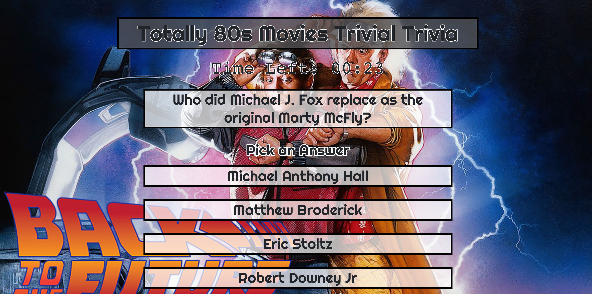
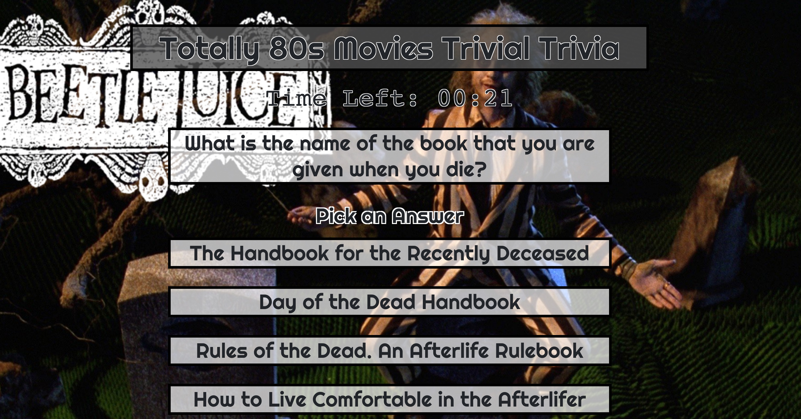

##80s Era Trivia Game

Homework 5. Create a interactive trivia game using Javascript and jQuery

20 question quiz. Each question covers one popular 80s movie.
Each quwstion has a background that represents that movie. I added the title of each 
movie so there was no confusion for people not familiar with the 80s.

You have 30 seconds to answer each question
A correct answer plays a fireworks and yea audio
An incorrect answer plays Kevin Spacey as Lex Luthor yelling wrong from Superman Returns. 
Audio downloaded from YouTube and edited to the correct audio section.
Time up also plays an audio file.

A correct, incorrect or time up shows the correct answer and an factoid about the movie.
Most factoids have something to do with the question. 

Once the quiz is complete. Your total right and wrong answers are shown. Time ups are 
counted as incorrect answers.

